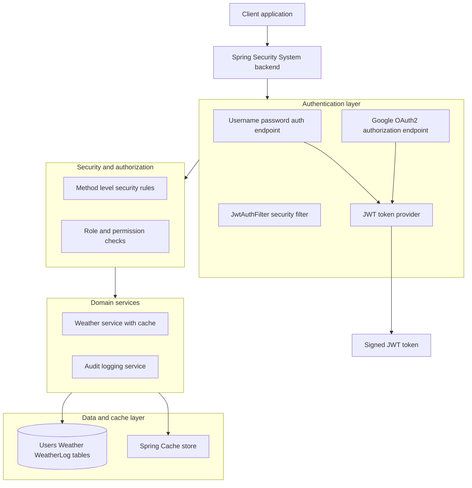

# Spring Security System 🔐

## Introduction

Spring Security is a Java-based framework that provides comprehensive security features for enterprise applications. The repository ashu12355/Spring-Security demonstrates the implementation of authentication, authorization, and secure resource access using Spring Security. It is designed for developers seeking to integrate security mechanisms into Spring Boot applications with minimal setup. This project is a secure backend that uses JWT, Google OAuth2, role-based access control, caching, and audit logging. 🚀

```card
{
  "title": "Spring Security System",
  "content": "Secure Spring Boot backend with JWT, Google OAuth2, RBAC, caching, and audit logging.",
  "type": "project",
  "filePath": "README.md",
  "badges": ["public"]
}
```

## Usage

This project serves as a template or learning tool for integrating Spring Security into new or existing Spring Boot applications. It offers examples of securing endpoints, handling user authentication, and implementing role-based access controls. Developers can clone the repository and run the application to observe how security is enforced on RESTful endpoints and other resources.

## Configuration

Spring Security is configured primarily using Java configuration classes and properties files. Key aspects include:

- Definition of security filter chains to manage authentication and authorization.
- Use of in-memory user details or JDBC-based authentication for user management.
- Configuration of HTTP security to define access rules for different URL patterns.
- Customization of login, logout, and error handling behavior.

Configuration files and annotations are used to set up password encoding, user roles, and authentication providers.

## Features

- User authentication with username and password.
- Role-based authorization to restrict access to certain endpoints.
- Custom login and logout endpoints.
- Password encoding for secure credential storage.
- Protection against common security threats such as CSRF.
- Clear separation of security configuration from business logic.

### Core Security and Caching Features ✨

This project implements a complete security and caching stack around Spring Security and Spring Cache.

- JWT authentication with username and password based login.
- OAuth2 login using Google as an external identity provider.
- Role-based access control with roles like ADMIN and USER.
- Permission-based authorization using permissions like READ, WRITE, DELETE.
- Method level security using `@PreAuthorize` and `@PostAuthorize` annotations.
- Custom `UserDetails` implementation for domain specific user data.
- Password encryption using BCrypt for secure password storage.
- Stateless authentication with JWT tokens on each HTTP request.
- Caching using `@Cacheable`, `@CachePut`, and `@CacheEvict` on service methods.
- Weather API endpoints that use caching for faster repeated responses.
- Audit logging system that tracks user actions and stores structured logs.

## Tech Stack 🧰

This project uses the following technologies and libraries.

- Java 17
- Spring Boot
- Spring Security
- JWT using `jjwt`
- OAuth2 client for Google authentication
- Spring Data JPA
- MySQL or H2 database
- Spring Cache abstraction

## Installation

Follow these steps to install and run the Spring Security sample project:

```steps
1. Clone Repository | Clone the repository to your local machine using `git clone https://github.com/ashu12355/Spring-Security.git`
2. Navigate Directory | Change to the project directory with `cd Spring-Security`
3. Build Project | Build the project using Maven: `mvn clean install`
4. Run Application | Start the application with `mvn spring-boot:run` or by running the generated JAR file
5. Access Application | Open your browser and go to `http://localhost:8080` to interact with the secured endpoints
```

## Setup Instructions ⚙️

Use these steps to configure environment specific settings and run the system locally. Keep your secrets private and outside version control.

```steps
1. Configure Database | Set MySQL or H2 datasource properties in `application.properties` or `application.yml`.
2. Configure Security | Define JWT secret, token validity, and OAuth2 settings in configuration properties.
3. Google OAuth2 Client | Register an app in Google Cloud Console and set client id and secret.
4. Run Migrations | Let JPA create tables automatically or run existing schema scripts if present.
5. Start Application | Run the Spring Boot application and test secured endpoints with Postman or curl.
```

> [!IMPORTANT]
> Ensure Google OAuth2 redirect URIs match the configured `/oauth2/authorization/google` and post login redirect endpoints.

## Requirements

- Java 8 or higher.
- Maven for building the project.
- Internet connection for dependency resolution.
- A compatible IDE (e.g., IntelliJ IDEA, Eclipse) for code exploration (optional).

## Contributing

Contributions are welcome! To contribute:

- Fork the repository.
- Create a new branch for your feature or bugfix.
- Commit and push your changes.
- Open a pull request explaining your modifications.

> [!NOTE]
> Please ensure you follow the established code style and provide clear documentation for any new features or changes.

## Architecture Diagram 🧩

This section shows the high level architecture of the Spring Security System. It highlights authentication, authorization, caching, and persistence layers.



> [!TIP]
> Use this diagram during interviews to quickly explain how authentication, authorization, and caching interact in the system. 😄

## API Documentation 📚

This section documents the main REST APIs exposed by the backend. Each endpoint includes method, path, parameters, and example responses.

### POST /authenticate

```api
{
  "title": "Authenticate user",
  "description": "Authenticate with username and password and receive a JWT token.",
  "method": "POST",
  "baseUrl": "http://localhost:8080",
  "endpoint": "/authenticate",
  "headers": [
    {
      "key": "Content-Type",
      "value": "application/json",
      "required": true
    }
  ],
  "queryParams": [],
  "pathParams": [],
  "bodyType": "json",
  "requestBody": "{\n  \"username\": \"john_doe\",\n  \"password\": \"password123\"\n}",
  "formData": [],
  "responses": {
    "200": {
      "description": "JWT token generated successfully",
      "body": "{\n  \"token\": \"eyJhbGciOiJIUzI1NiIsInR5cCI6IkpXVCJ9...\",\n  \"type\": \"Bearer\"\n}"
    },
    "401": {
      "description": "Invalid credentials",
      "body": "{\n  \"error\": \"Bad credentials\"\n}"
    }
  }
}
```

### POST /api/users/register

```api
{
  "title": "Register user",
  "description": "Register a new user with a role and encrypted password.",
  "method": "POST",
  "baseUrl": "http://localhost:8080",
  "endpoint": "/api/users/register",
  "headers": [
    {
      "key": "Content-Type",
      "value": "application/json",
      "required": true
    }
  ],
  "queryParams": [],
  "pathParams": [],
  "bodyType": "json",
  "requestBody": "{\n  \"username\": \"john_doe\",\n  \"password\": \"password123\",\n  \"role\": \"USER\"\n}",
  "formData": [],
  "responses": {
    "201": {
      "description": "User registered successfully",
      "body": "{\n  \"id\": 1,\n  \"username\": \"john_doe\",\n  \"role\": \"USER\"\n}"
    },
    "400": {
      "description": "Validation error or username already exists",
      "body": "{\n  \"error\": \"Username already in use\"\n}"
    }
  }
}
```

### GET /oauth2/authorization/google

```api
{
  "title": "Google OAuth2 login",
  "description": "Initiate Google OAuth2 login flow for the user.",
  "method": "GET",
  "baseUrl": "http://localhost:8080",
  "endpoint": "/oauth2/authorization/google",
  "headers": [],
  "queryParams": [],
  "pathParams": [],
  "bodyType": "none",
  "requestBody": "",
  "formData": [],
  "responses": {
    "302": {
      "description": "Redirect to Google login page",
      "body": "{\n  \"location\": \"https://accounts.google.com/...\"\n}"
    },
    "500": {
      "description": "OAuth2 configuration error",
      "body": "{\n  \"error\": \"OAuth2 client configuration issue\"\n}"
    }
  }
}
```

### GET /weather

```api
{
  "title": "Get weather",
  "description": "Fetch weather for all cities or a default city, using caching.",
  "method": "GET",
  "baseUrl": "http://localhost:8080",
  "endpoint": "/weather",
  "headers": [
    {
      "key": "Authorization",
      "value": "Bearer <jwt-token>",
      "required": true
    }
  ],
  "queryParams": [],
  "pathParams": [],
  "bodyType": "none",
  "requestBody": "",
  "formData": [],
  "responses": {
    "200": {
      "description": "Weather data returned and possibly served from cache",
      "body": "{\n  \"data\": [\n    {\"city\": \"Berlin\", \"forecast\": \"Sunny\"}\n  ]\n}"
    },
    "403": {
      "description": "Forbidden due to missing permissions",
      "body": "{\n  \"error\": \"Access is denied\"\n}"
    }
  }
}
```

### POST /weather

```api
{
  "title": "Add weather",
  "description": "Create a new weather entry and update cache.",
  "method": "POST",
  "baseUrl": "http://localhost:8080",
  "endpoint": "/weather",
  "headers": [
    {
      "key": "Authorization",
      "value": "Bearer <jwt-token>",
      "required": true
    },
    {
      "key": "Content-Type",
      "value": "application/json",
      "required": true
    }
  ],
  "queryParams": [],
  "pathParams": [],
  "bodyType": "json",
  "requestBody": "{\n  \"city\": \"Berlin\",\n  \"forecast\": \"Sunny\"\n}",
  "formData": [],
  "responses": {
    "201": {
      "description": "Weather created successfully",
      "body": "{\n  \"city\": \"Berlin\",\n  \"forecast\": \"Sunny\"\n}"
    },
    "400": {
      "description": "Invalid payload",
      "body": "{\n  \"error\": \"Invalid weather data\"\n}"
    }
  }
}
```

### PUT /weather/{city}

```api
{
  "title": "Update weather",
  "description": "Update weather for a city and refresh related cache entry.",
  "method": "PUT",
  "baseUrl": "http://localhost:8080",
  "endpoint": "/weather/{city}",
  "headers": [
    {
      "key": "Authorization",
      "value": "Bearer <jwt-token>",
      "required": true
    },
    {
      "key": "Content-Type",
      "value": "application/json",
      "required": true
    }
  ],
  "queryParams": [],
  "pathParams": [
    {
      "key": "city",
      "value": "City name to update",
      "required": true
    }
  ],
  "bodyType": "json",
  "requestBody": "{\n  \"forecast\": \"Cloudy\"\n}",
  "formData": [],
  "responses": {
    "200": {
      "description": "Weather updated successfully",
      "body": "{\n  \"city\": \"Berlin\",\n  \"forecast\": \"Cloudy\"\n}"
    },
    "404": {
      "description": "City not found",
      "body": "{\n  \"error\": \"City not found\"\n}"
    }
  }
}
```

### DELETE /weather/{city}

```api
{
  "title": "Delete weather",
  "description": "Delete weather entry for a city and evict cache entry.",
  "method": "DELETE",
  "baseUrl": "http://localhost:8080",
  "endpoint": "/weather/{city}",
  "headers": [
    {
      "key": "Authorization",
      "value": "Bearer <jwt-token>",
      "required": true
    }
  ],
  "queryParams": [],
  "pathParams": [
    {
      "key": "city",
      "value": "City name to delete",
      "required": true
    }
  ],
  "bodyType": "none",
  "requestBody": "",
  "formData": [],
  "responses": {
    "204": {
      "description": "Weather deleted successfully",
      "body": ""
    },
    "404": {
      "description": "City not found",
      "body": "{\n  \"error\": \"City not found\"\n}"
    }
  }
}
```

### GET /logs/{id}

```api
{
  "title": "Get audit log",
  "description": "Fetch a specific audit log by its identifier.",
  "method": "GET",
  "baseUrl": "http://localhost:8080",
  "endpoint": "/logs/{id}",
  "headers": [
    {
      "key": "Authorization",
      "value": "Bearer <jwt-token>",
      "required": true
    }
  ],
  "queryParams": [],
  "pathParams": [
    {
      "key": "id",
      "value": "Identifier of the log entry",
      "required": true
    }
  ],
  "bodyType": "none",
  "requestBody": "",
  "formData": [],
  "responses": {
    "200": {
      "description": "Audit log returned successfully",
      "body": "{\n  \"id\": 10,\n  \"action\": \"DELETE_WEATHER\",\n  \"performedBy\": \"admin\",\n  \"timestamp\": \"2024-01-01T10:00:00Z\"\n}"
    },
    "404": {
      "description": "Log not found",
      "body": "{\n  \"error\": \"Log not found\"\n}"
    }
  }
}
```

### POST /logs/create

```api
{
  "title": "Create audit log",
  "description": "Create a new audit log entry for a user action.",
  "method": "POST",
  "baseUrl": "http://localhost:8080",
  "endpoint": "/logs/create",
  "headers": [
    {
      "key": "Authorization",
      "value": "Bearer <jwt-token>",
      "required": true
    },
    {
      "key": "Content-Type",
      "value": "application/json",
      "required": true
    }
  ],
  "queryParams": [],
  "pathParams": [],
  "bodyType": "json",
  "requestBody": "{\n  \"action\": \"UPDATE_WEATHER\",\n  \"performedBy\": \"admin\"\n}",
  "formData": [],
  "responses": {
    "201": {
      "description": "Audit log created successfully",
      "body": "{\n  \"id\": 11,\n  \"action\": \"UPDATE_WEATHER\",\n  \"performedBy\": \"admin\",\n  \"timestamp\": \"2024-01-01T11:00:00Z\"\n}"
    },
    "400": {
      "description": "Invalid payload",
      "body": "{\n  \"error\": \"Invalid audit log data\"\n}"
    }
  }
}
```

## Security Flow 🔒

This section describes the authentication and authorization flow for protected operations. The application uses stateless JWT based security and OAuth2.

1. User initiates login using username and password or Google OAuth2.
2. Backend validates credentials or Google identity, then builds authentication details.
3. JWT provider issues a signed token that encodes user id, roles, and permissions.
4. Client sends JWT token in the `Authorization: Bearer <token>` header for each request.
5. `JwtAuthFilter` [badge:public] extracts and validates the token on every incoming request.
6. Spring Security builds an authenticated principal using the custom `UserDetails` implementation.
7. Role based access control and permission checks enforce access rules on URLs and methods.
8. Method level annotations `@PreAuthorize` and `@PostAuthorize` protect service operations.
9. Audit logging records important actions, including actor identity and timestamp, in the log table.

> [!WARNING]
> Stateless JWT authentication means logout only works by token expiration or explicit invalidation logic.

## Database Design 🗄️

The system uses relational tables for users, weather data, and audit logs. You can run on MySQL or H2.

### Users Table

| Column   | Type    | Description                      |
|----------|---------|----------------------------------|
| id       | Long    | Primary key identifier           |
| username | String  | Unique username for the account  |
| password | String  | BCrypt encrypted password        |
| role     | String  | Role name, for example ADMIN     |

### Weather Table

| Column  | Type   | Description                      |
|---------|--------|----------------------------------|
| city    | String | Primary key city name            |
| forecast| String | Weather forecast description     |

### WeatherLog Table

| Column      | Type   | Description                                |
|-------------|--------|--------------------------------------------|
| id          | Long   | Primary key identifier                     |
| action      | String | Action name, for example CREATE_WEATHER    |
| performedBy | String | Username who performed the action          |
| timestamp   | Date   | Time when the action was recorded          |

> [!NOTE]
> Audit logs help demonstrate compliance and traceability in security sensitive environments. 📜

## Future Enhancements 🚧

This section reserves space for documenting future enhancements defined by the project maintainers. It can include planned endpoints, security rules, or monitoring integrations once they are specified.

---

This README provides a detailed overview of the Spring-Security repository, outlining its purpose, usage, configuration, and contribution guidelines. For further exploration, examine the project files and configuration classes for practical implementation details.
